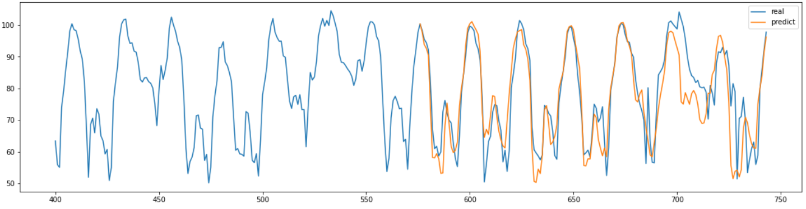

# TimeSeriesForecast-Informer

Code Implementation of  
**Informer: Beyond Efficient Transformer for Long Sequence Time-Series Forecasting (AAAI'21 Best Paper)**
&nbsp;

explain

<https://doheon.github.io/%EC%BD%94%EB%93%9C%EA%B5%AC%ED%98%84/time-series/ci-5.informer-post/>

**reference**

code: <https://github.com/zhouhaoyi/Informer2020>

paper: <https://arxiv.org/pdf/2012.07436v3.pdf>

&nbsp;

# Result

